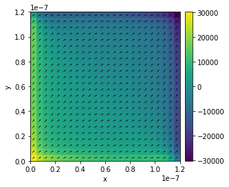
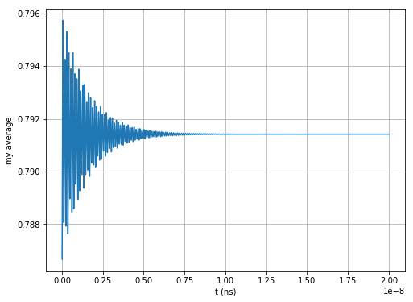
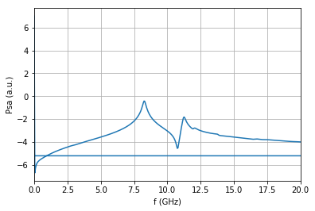

```python
import oommfc as oc
import discretisedfield as df
```


```python
import numpy as np

lx = ly = 120e-9  # x and y dimensions of the sample(m)
lz = 10e-9  # sample thickness (m)
dx = dy = dz = 5e-9  # discretisation in x, y, and z directions (m)

Ms = 8e5  # saturation magnetisation (A/m)
A = 1.3e-11  # exchange energy constant (J/m)
H = 8e4 * np.array([0.81345856316858023, 0.58162287266553481, 0.0])
alpha = 0.008  # Gilbert damping
gamma = 2.211e5
```


```python

mesh = oc.Mesh(p1=(0, 0, 0), p2=(lx, ly, lz), cell=(dx, dy, dz))

system = oc.System(name="stdprobfmr")

system.hamiltonian = oc.Exchange(A) + oc.Demag() + oc.Zeeman(H)
system.dynamics = oc.Precession(gamma) + oc.Damping(alpha)
system.m = df.Field(mesh, value=(0, 0, 1), norm=Ms)
```


```python
md = oc.MinDriver()
md.drive(system)
```

    2018/09/09 20:54: Running OOMMF (stdprobfmr\stdprobfmr.mif) ... (3.9 s)
    


```python
%matplotlib inline
system.m.plot_plane("z")
```





```python
# Change external magnetic field.
H = 8e4 * np.array([0.81923192051904048, 0.57346234436332832, 0.0])
system.hamiltonian.zeeman.H = H
```


```python
T = 20e-9
n = 4000

td = oc.TimeDriver()
td.drive(system, t=T, n=n)
```

    2018/09/09 20:54: Running OOMMF (stdprobfmr\stdprobfmr.mif) ... (90.9 s)
    


```python
import matplotlib.pyplot as plt

t = system.dt['t'].as_matrix()
my = system.dt['mx'].as_matrix()

# Plot <my> time evolution.
plt.figure(figsize=(8, 6))

plt.plot(t, my)
plt.xlabel('t (ns)')
plt.ylabel('my average')
plt.grid()
```

    D:\anaconda\lib\site-packages\ipykernel_launcher.py:3: FutureWarning: Method .as_matrix will be removed in a future version. Use .values instead.
      This is separate from the ipykernel package so we can avoid doing imports until
    D:\anaconda\lib\site-packages\ipykernel_launcher.py:4: FutureWarning: Method .as_matrix will be removed in a future version. Use .values instead.
      after removing the cwd from sys.path.
    





```python
import scipy.fftpack

psd = np.log10(np.abs(scipy.fftpack.fft(my))**2)
f_axis = scipy.fftpack.fftfreq(n, d=T/n)

plt.plot(f_axis/1e9, psd)
plt.xlim([0,20])
plt.xlabel('f (GHz)')
plt.ylabel('Psa (a.u.)')
plt.grid()
```




